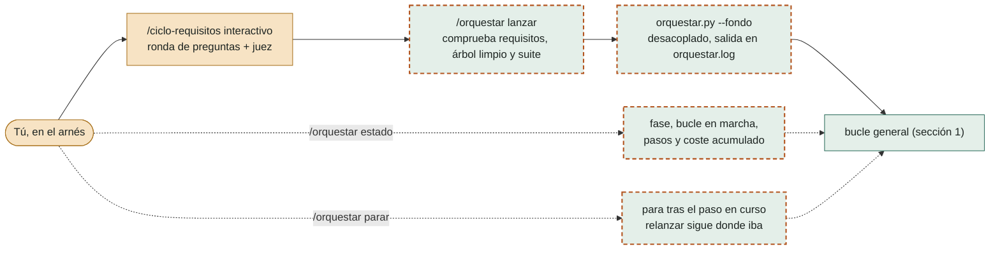
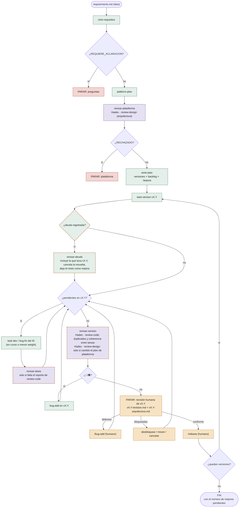
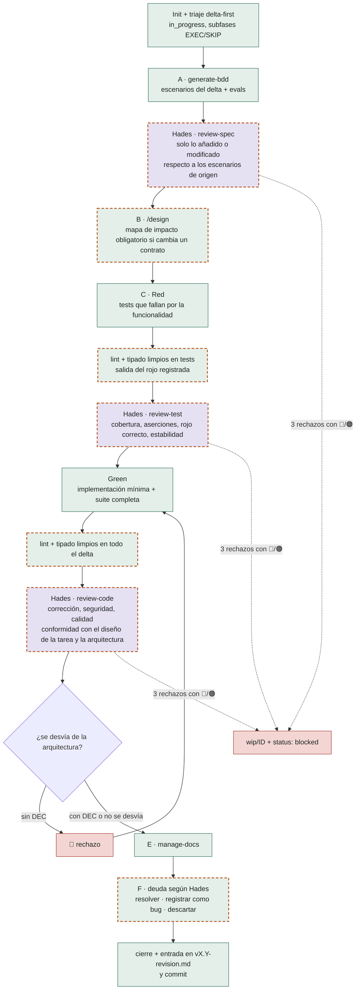

# Orquestación NereoSkills

Vista general del flujo. Las reglas viven en las skills; si algo no coincide, mandan ellas.

## 0. Arranque desde un arnés

La conversación se limita a los requisitos. Después, `/orquestar` lanza el bucle desatendido y vuelve; el bucle deduce la fase del disco y continúa desde donde toque.

## 1. Bucle general (`orquestar.py`)

Cada caja es una ejecución del arnés con contexto limpio. Paradas en cualquier punto: paso sin progreso tras 2 intentos, tarea cerrada con la suite en rojo (`--test`), fallo del arnés, `--parar` y `--max-pasos`. Cada paso deja una línea en `orquestar_metricas.jsonl`.

## 2. Dentro de una tarea (`task-dev` / `bug-fix` en modo orquestado)

Sin pausas para el humano: lo que se habría validado va a `vX.Y-revision.md`. Cada revisión admite hasta 3 iteraciones. Una desviación de la arquitectura se registra como `DEC` en el plan de plataforma; la revisa `review-design` en la revisión de versión.

## 3. Quién revisa qué

| Revisión | Cuándo | Mira | Nunca mira |
|---|---|---|---|
| `review-spec` | Cada tarea, antes del diseño | Solo lo que la tarea añade o modifica en escenarios y evals; trazabilidad que existe y corresponde | Diseño ni código |
| `review-design` | `revisar-plataforma` y `revisar-version` | Plan de plataforma y sus `DEC` | Código ni diseños por tarea |
| `review-test` | Cada tarea, tras el rojo | Cobertura, aserciones, rojo correcto, estabilidad y preparación de las pruebas | Código de producción |
| `review-code` | Cada tarea, tras el verde, y transversal en `revisar-version` | Corrección, seguridad, calidad, eficiencia, docs y conformidad con el diseño y la arquitectura (incluye build, CI y configuración) | Pruebas |

Lo determinista (lint, tipado, rojo de la suite) se ejecuta antes de llamar a Hades. Cada 🟡/🔵 lleva un destino: `resolver` (por defecto), `registrar` (bug de deuda sin versión, peso > 1000, con su origen) o `descartar`. `revisar-deuda`, al abrir cada versión, decide qué deuda entra.
